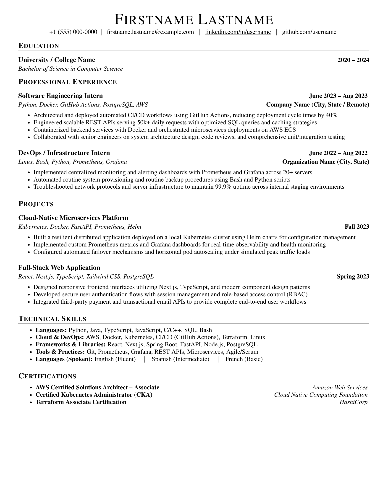

# LaTeX Resume Template

A clean, modern, ATS-friendly **LaTeX résumé/CV template** designed for software engineers, DevOps practitioners, and tech professionals.

Everything is self-contained in a single, customizable file: [`template.tex`](./template.tex).

---

## 📄 Preview

<p align="center">
  
</p>

---

## ⚙️ How to Generate PDF

To directly compile and generate `template.pdf` from `template.tex`:

### Option 1: Using `pdflatex` (TeX Live, MiKTeX, MacTeX)
Run the following command in your terminal:
```bash
pdflatex template.tex
```
This will compile and output `template.pdf` directly in the current directory.

> **Tip:** Running it a second time ensures all cross-references and page counts are updated:
> ```bash
> pdflatex template.tex && pdflatex template.tex
> ```

### Option 2: Using `tectonic` (Zero-setup modern TeX engine)
If you prefer not to manage LaTeX package managers, install [Tectonic](https://tectonic-typesetting.github.io/) and run:
```bash
tectonic template.tex
```
Tectonic automatically downloads required fonts and packages on-the-fly and generates `template.pdf`.

### Option 3: Online via Overleaf
1. Open [Overleaf](https://www.overleaf.com/) and create a new blank project.
2. Replace `main.tex` with the contents of [`template.tex`](./template.tex) (or upload `template.tex`).
3. Click **Recompile**.

---

## 📂 Repository Structure

- **`template.tex`** → Single, self-contained LaTeX document containing layout definitions, formatting macros, and all content sections.
- **`preview.png`** → High-resolution visual preview of the compiled resume.

---

## ✏️ How to Customize

Open `template.tex` and modify the sections with your information:

### 1. Personal Information & Header
Update your contact details in the definitions block:
```latex
\def\firstname{Firstname}
\def\lastname{Lastname}
\def\email{firstname.lastname@example.com}
\def\linkedin{https://linkedin.com/in/username}
\def\github{https://github.com/username}
\def\jasphone{+1 (555) 000-0000}
```

### 2. Education
Define your degree, years, institution, and major:
```latex
\EducationTemplate{College}{StartYear}{EndYear}{University / College Name}{Degree Title}{}
```

### 3. Experience & Internships
Define your roles using `StageTemplate`:
```latex
\StageTemplate{id}{Date Range}{Key Technologies}{Role / Designation}{Company Name (Location)}{
  \jbegin
    \jitem{Key achievement or contribution with metrics}
    \jitem{Action-oriented bullet point describing technical impact}
  \jend
}
```
Render it in the document body:
```latex
\renderExp{id}
```

### 4. Projects
Define projects using `ExpTemplate`:
```latex
\ExpTemplate{id}{Technologies Used}{Project Title}{Date}{
  \jbegin
    \jitem{Overview of technical implementation and architecture}
    \jitem{Quantifiable performance improvement or key capability}
  \jend
}
```
Render it in the document body:
```latex
\renderExp{id}
```

### 5. Technical Skills & Certifications
- **`\achievements`**: Organize your skills by category (e.g., Languages, Cloud & DevOps, Frameworks, Tools).
- **`\certifications`**: List your industry certifications and issuing organizations.
